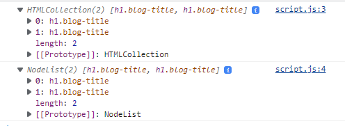

<h3>Qual usar?</h3>
 

getElementByID -> (element)

getElementsByClassName -> (HTMLCollection)

getElementsByTagName -> (HTMLCollection)

querySlecetor -> (element)

querySelectorAll -> (NodeList) - da para usar o forEach

 
